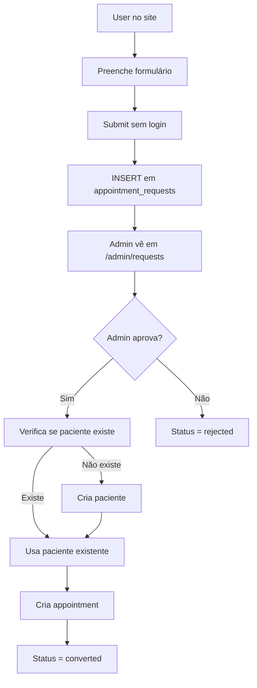
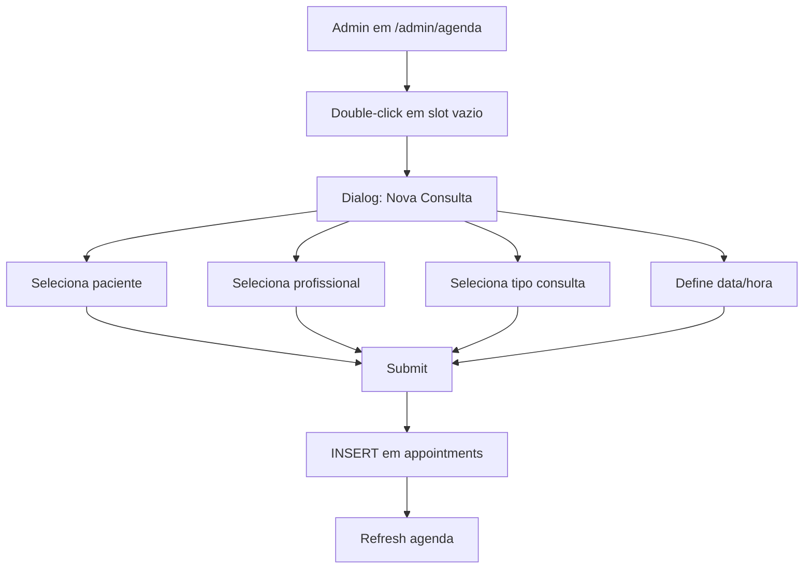
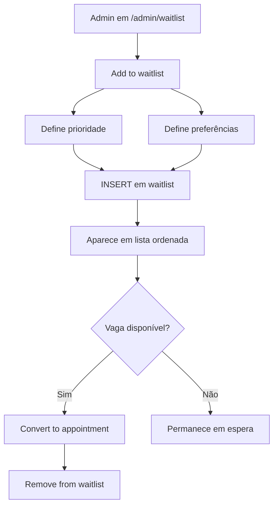

# 🏥 MediFranco - Análise Funcional Completa

**Versão**: 1.0  
**Data**: 2026-01-27  
**Tipo**: Website Principal (Gestão de Clínica)  
**Público-alvo**: Clínicas médicas/dentárias com múltiplos profissionais

---

## 📋 ÍNDICE

1. [Visão Geral](#1-visão-geral)
2. [Arquitetura Técnica](#2-arquitetura-técnica)
3. [Funcionalidades Implementadas](#3-funcionalidades-implementadas)
4. [Área Pública (Website)](#4-área-pública-website)
5. [Área Administrativa](#5-área-administrativa)
6. [UX & Design](#6-ux--design)
7. [Fluxos de Trabalho](#7-fluxos-de-trabalho)
8. [Integrações](#8-integrações)
9. [Estado Atual vs. Roadmap](#9-estado-atual-vs-roadmap)
10. [Decisões Técnicas & Rationale](#10-decisões-técnicas--rationale)

---

## 1. VISÃO GERAL

### 1.1 Propósito

MediFranco é uma plataforma web completa para **gestão de clínicas médicas/dentárias** que permite:
- **Pacientes**: Pedir consultas online via formulário público
- **Clínica**: Gerir agenda, pacientes, consultas, lista de espera, mensagens
- **Profissionais**: Visualizar agenda pessoal, gerir consultas

### 1.2 Principais Características

✅ **Agenda Visual Dinâmica** (drag-and-drop)  
✅ **Gestão de Pacientes** (NIF único, histórico completo)  
✅ **Lista de Espera Inteligente** (prioridades, preferências)  
✅ **Formulários Públicos** (sem login necessário)  
✅ **Multi-especialidade** (Oftalmologia + Medicina Dentária)  
✅ **WhatsApp Automation** (preparado, não ativo)  
✅ **RLS Security** (Row-Level Security no Supabase)  
✅ **Responsive Design** (mobile-first)

### 1.3 Diferenciais

- ⚡ **Performance**: React Query para caching, queries optimizadas
- 🔒 **Segurança**: RLS em todas as tabelas, role-based access
- 🎨 **UX Premium**: Shadcn/ui components, animações suaves
- 📊 **Analytics Ready**: Estrutura para relatórios e KPIs
- 🔧 **Extensível**: Arquitetura modular, fácil adicionar features

---

## 2. ARQUITETURA TÉCNICA

### 2.1 Stack Tecnológico

#### Frontend
```
Framework: React 18.3.1 + TypeScript
Build Tool: Vite 5.4.19
Routing: React Router DOM 6.30.1
State Management: @tanstack/react-query 5.83.0
UI Library: Shadcn/ui (Radix UI + Tailwind)
Forms: React Hook Form + Zod validation
Styling: Tailwind CSS 3.4.17
Icons: Lucide React
Drag-and-Drop: @dnd-kit
Charts: Recharts
Rich Text: TipTap (para blog/notas)
```

#### Backend
```
BaaS: Supabase
Database: PostgreSQL (via Supabase)
Auth: Supabase Auth
Storage: Supabase Storage (imagens)
Real-time: Supabase Realtime (websockets)
```

#### Deployment
```
Frontend: Vercel
Backend: Supabase Cloud
Domain: medifranco.pt (assumindo)
```

### 2.2 Estrutura de Pastas

```
src/
├── components/          # 91 componentes
│   ├── admin/          # Componentes admin-only
│   ├── blog/           # Componentes de blog
│   └── ui/             # Shadcn UI primitives
├── pages/              # 19 páginas
│   ├── Index.tsx       # Homepage
│   ├── BlogListingPage.tsx
│   ├── BlogPostDetailPage.tsx
│   ├── AdminLogin.tsx
│   └── admin/          # 13 páginas admin
│       ├── DashboardPage.tsx
│       ├── AgendaPage.tsx
│       ├── PatientsPage.tsx
│       ├── WaitlistPage.tsx
│       ├── RequestsPage.tsx
│       ├── MessagesPage.tsx
│       ├── StatisticsPage.tsx
│       ├── SettingsPage.tsx
│       ├── BlogPage.tsx
│       └── ...
├── hooks/              # 16 custom hooks
│   ├── useAppointments.ts
│   ├── usePatients.ts
│   ├── useWaitlist.ts
│   └── ...
├── types/              # 4 type definitions
├── lib/                # Utilities
├── integrations/       # Supabase client
└── data/               # Mock data / constants
```

### 2.3 Arquitetura de Dados

**Ver documento**: `BACKEND_REPLICATION.md` para schema completo

**Resumo**:
- 12 tabelas principais
- RLS ativo em todas
- Sistema de roles (admin/user)
- CASCADE deletes configurados
- Índices para performance

### 2.4 Autenticação & Autorização

**Sistema de Roles**:
```sql
user_roles.role = 'admin' | 'user'
```

**Flow**:
1. User faz login (Supabase Auth)
2. Query `user_roles` para verificar role
3. RLS policies bloqueiam dados se não admin
4. Frontend esconde UI admin se não autorizado

**Protected Routes**:
- `/admin/*` → Requer `role=admin`
- Resto → Público (exceto data queries)

---

## 3. FUNCIONALIDADES IMPLEMENTADAS

### ✅ 3.1 Sistema de Autenticação

**Status**: 100% Funcional

**Features**:
- [x] Login com email/password
- [x] Logout
- [x] Session persistence
- [x] Protected routes
- [x] Role verification (admin/user)

**Decisões**:
- **Porquê Supabase Auth**: Não reinventar a roda, seguro, escalável
- **Porquê roles em DB**: Mais controlo que Supabase metadata

**UX**:
- Redirect para dashboard após login
- Redirect para home após logout
- Loading states durante auth

---

### ✅ 3.2 Homepage & Website Público

**Status**: 100% Funcional

**Secções**:
1. **Hero** - Cabeçalho com CTA "Marcar Consulta"
2. **Serviços** - Oftalmologia + Medicina Dentária
3. **Sobre** - História da clínica
4. **Equipa** - Profissionais (hardcoded, não vem de DB)
5. **FAQ** - Perguntas frequentes
6. **Contacto** - Formulário + morada

**Features**:
- [x] Responsive
- [x] Animações scroll-reveal
- [x] Navigation menu
- [x] Footer completo

**Decisões**:
- **Porquê não puxar equipa da DB**: Conteúdo marketing, não operacional
- **Porquê hardcoded**: Mais rápido, menos queries

**Melhorias Futuras**:
- [ ] CMS para editar conteúdo (opcional)
- [ ] Otimizar imagens (lazy load)

---

### ✅ 3.3 Formulários Públicos

#### A) Pedido de Consulta

**Status**: 100% Funcional

**Campos**:
- Nome completo
- Email
- Telefone
- NIF
- Tipo de serviço (Dentária/Oftalmologia)
- Data preferida
- Hora preferida
- Notas (opcional)

**Flow**:
1. User preenche formulário (sem login)
2. INSERT em `appointment_requests` (RLS permite INSERT público)
3. Admin vê pedido em `/admin/requests`
4. Admin aprova → cria appointment real
5. Status muda para `converted`

**Validação**:
- React Hook Form + Zod
- NIF validado (formato português)
- Email format
- Phone format
- Data não no passado

**Decisões**:
- **Porquê sem auth**: Reduzir fricção, maximizar conversões
- **Porquê `appointment_requests` separada**: Não misturar com appointments reais

#### B) Contacto

**Status**: 100% Funcional

**Campos**:
- Nome
- Email
- Telefone
- Mensagem

**Flow**:
1. User envia (sem login)
2. INSERT em `contact_messages`
3. Admin vê em `/admin/messages`
4. Admin marca como lida/arquivada

**Decisões**:
- **Porquê separar de appointments**: Diferentes propósitos
- **Porquê simples**: Não queremos barreira

---

### ✅ 3.4 Blog

**Status**: 100% Funcional (mas pode ser removido)

**Features**:
- [x] Listagem de posts
- [x] Post detail page
- [x] Rich text editor (TipTap)
- [x] Imagens (array de URLs)
- [x] Slug único
- [x] Published date
- [x] Author

**Admin**:
- Criar/editar/deletar posts
- Preview antes de publicar

**Decisões**:
- **Porquê TipTap**: Open-source, extensível, bom UX
- **Porquê slug único**: SEO friendly URLs

**Nota**: Pode ser removido se clínica não usa blog (já removido do BACKEND_REPLICATION.md)

---

### ✅ 3.5 Painel Admin - Dashboard

**Status**: 100% Funcional

**Path**: `/admin/dashboard`

**Widgets**:
1. **Estatísticas Rápidas**
   - Total consultas hoje
   - Pacientes em espera
   - Pedidos pendentes
   - Mensagens não lidas

2. **Próximas Consultas** (hoje + amanhã)
   - Lista com nome paciente, hora, profissional

3. **Ações Rápidas**
   - Nova consulta
   - Novo paciente
   - Lista de espera

**Decisões**:
- **Porquê dashboard**: Overview rápido ao iniciar dia
- **Porquê stats**: Métricas importantes sempre visíveis

**Melhorias Futuras**:
- [ ] Gráficos de tendências
- [ ] Notificações em tempo real

---

### ✅ 3.6 Agenda (Calendar)

**Status**: 100% Funcional

**Path**: `/admin/agenda`

**Tipo**: Drag-and-drop calendar

**Features**:
- [x] View por dia/semana
- [x] Drag appointments para nova hora
- [x] Color-code por profissional
- [x] Double-click para criar nova consulta
- [x] Click em consulta para editar
- [x] Filtros por profissional/especialidade
- [x] Visualização de conflitos (horários ocupados)

**Tecnologia**:
- `@dnd-kit/core` para drag-and-drop
- Custom calendar grid (não lib externa)
- React Query para sync com DB

**Flow**:
1. Admin vê agenda
2. Arrasta consulta para nova hora
3. UPDATE `appointments` com nova hora
4. Optimistic update (UI atualiza imediatamente)
5. Se erro, rollback

**Decisões**:
- **Porquê custom calendar**: Libs externas muito rígidas, queremos UX específica
- **Porquê drag-and-drop**: UX superior a formulários
- **Porquê optimistic updates**: Feedback instantâneo

**Melhorias Futuras**:
- [ ] View mensal
- [ ] Print agenda
- [ ] Export para iCal

---

### ✅ 3.7 Pacientes

**Status**: 100% Funcional

**Path**: `/admin/patients`

**Features**:
- [x] Lista de todos pacientes
- [x] Search por nome/NIF/telefone
- [x] Filtros por tags
- [x] Ordenação
- [x] Criar novo paciente
- [x] Editar paciente
- [x] Ver histórico de consultas

**Detail Page**: `/admin/patients/:id`
- Dados pessoais (nome, NIF, email, phone, birth_date)
- Tags (ex: "VIP", "Diabético")
- Notas internas
- Histórico completo de consultas (tabela filtrada por `patient_id`)
- Ações rápidas (marcar consulta, adicionar a waitlist)

**Validações**:
- NIF único (constraint DB)
- Email format (opcional)
- Phone required

**Decisões**:
- **Porquê NIF como unique ID**: Sistema português, todos têm NIF
- **Porquê tags array**: Flexibilidade sem criar tabelas extras
- **Porquê notas em plaintext**: Não precisamos rich text para notas internas

**Melhorias Futuras**:
- [ ] Upload de documentos (receitas, exames)
- [ ] Anexar imagens de pagamentos
- [ ] Export pacientes para CSV

---

### ✅ 3.8 Lista de Espera (Waitlist)

**Status**: 100% Funcional

**Path**: `/admin/waitlist`

**Features**:
- [x] Adicionar paciente à lista
- [x] Prioridades (low/medium/high)
- [x] Preferências de horário (morning/afternoon/any)
- [x] Datas preferidas (array)
- [x] Razão para espera
- [x] Ordenação manual (drag-and-drop)
- [x] Converter para appointment real
- [x] Remover da lista

**Flow**:
1. Admin adiciona paciente à waitlist
2. Define prioridade e preferências
3. Quando vaga aparece, admin vê waitlist
4. Cria appointment a partir de waitlist entry
5. Entry removida automaticamente (ou marcada como convertida)

**Decisões**:
- **Porquê separar de appointments**: Diferentes estados (espera vs. marcada)
- **Porquê sort_order**: Permite ordenação manual quando prioridades iguais
- **Porquê preferred_dates array**: Paciente pode ter várias datas possíveis

**Melhorias Futuras**:
- [ ] Notificação automática quando vaga abre
- [ ] Sugestão inteligente de horários

---

### ✅ 3.9 Pedidos de Consulta (Requests)

**Status**: 100% Funcional

**Path**: `/admin/requests`

**Features**:
- [x] Ver todos pedidos públicos
- [x] Filtrar por status (pending/approved/rejected/converted)
- [x] Ver detalhes do pedido
- [x] Aprovar → gerar appointment + criar paciente se não existe
- [x] Rejeitar
- [x] Adicionar notas internas

**Flow**:
1. User submete pedido via formulário público
2. Aparece em `/admin/requests` com status `pending`
3. Admin revê pedido
4. Se aprovar:
   - Verifica se paciente com NIF já existe
   - Se não, cria paciente
   - Cria appointment
   - Muda status para `converted`
5. Se rejeitar:
   - Status = `rejected`
   - (Opcional) Envio de email manual explicando

**Decisões**:
- **Porquê não auto-approve**: Queremos validar antes
- **Porquê check NIF**: Evitar duplicados de pacientes
- **Porquê status `converted`**: Rastreabilidade

**Melhorias Futuras**:
- [ ] Email automático após aprovação/rejeição
- [ ] Dashboard widget para pedidos pendentes

---

### ✅ 3.10 Mensagens de Contacto

**Status**: 100% Funcional

**Path**: `/admin/messages`

**Features**:
- [x] Lista de mensagens
- [x] Filtros por status (new/read/archived)
- [x] Marcar como lida
- [x] Arquivar
- [x] Ver detalhes completos

**Flow**:
1. User envia mensagem via formulário contacto
2. Aparece em `/admin/messages` com status `new`
3. Admin lê → marca `read`
4. Após responder (manual, via email), arquiva → `archived`

**Decisões**:
- **Porquê não integrar email**: Sistema simples, não queremos servidor SMTP
- **Porquê 3 status**: Workflow claro (novo → lido → arquivado)

**Melhorias Futuras**:
- [ ] Resposta direta da plataforma
- [ ] Templates de respostas

---

### ✅ 3.11 Configurações (Settings)

**Status**: 100% Funcional

**Path**: `/admin/settings`

**Features**:
- [x] Horário de funcionamento (por dia da semana)
- [x] Duração padrão de consultas
- [x] Buffer entre consultas
- [x] Editar especialidades
- [x] Editar tipos de consulta (nome, duração, cor)
- [x] Gerir salas/gabinetes
- [x] Gerir profissionais

**Estrutura**:
```typescript
clinic_settings: {
  working_hours: {
    monday: { start: "09:00", end: "18:00", enabled: true },
    ...
  },
  default_duration: 30,
  buffer_between_appointments: 5
}
```

**Decisões**:
- **Porquê JSONB**: Flexibilidade para adicionar configs
- **Porquê não hardcoded**: Cada clínica tem horários diferentes
- **Porquê colors nos consultation_types**: Visual distinction na agenda

---

### ✅ 3.12 Estatísticas

**Status**: 70% Funcional (básico implementado)

**Path**: `/admin/statistics`

**Features Implementadas**:
- [x] Total consultas (por período)
- [x] Consultas por profissional
- [x] Consultas por especialidade
- [x] Status breakdown (scheduled/completed/cancelled)
- [x] Gráficos com Recharts

**Features Pendentes**:
- [ ] Revenue tracking
- [ ] No-show rate
- [ ] Average waiting time
- [ ] Patient retention
- [ ] Export para PDF/Excel

**Decisões**:
- **Porquê Recharts**: Lightweight, boas opções de gráficos
- **Porquê não real-time**: Stats não precisam ser instant

---

### ⚠️ 3.13 WhatsApp Workflows

**Status**: 70% Implementado (DB ready, UI pronta, automação OFF)

**Tabela**: `whatsapp_workflows`

**Tipos de Workflow**:
- `confirmation_24h` - Confirmação 24h antes
- `review_reminder` - Lembrete pós-consulta
- `availability_suggestion` - Sugestão de vaga (waitlist)

**Estado Atual**:
- ✅ DB schema pronto
- ✅ Triggers preparados
- ✅ UI para ver workflows pendentes
- ❌ Integração com API WhatsApp (não ativa)
- ❌ Cron job para processar workflows

**Decisões**:
- **Porquê não ativo**: Requer API WhatsApp Business (custo + setup)
- **Porquê estrutura pronta**: Fácil ativar depois

**Próximos Passos para Ativar**:
1. Contratar serviço WhatsApp API (ex: Twilio)
2. Criar Edge Function para enviar mensagens
3. Criar cron job (Supabase + pg_cron)
4. Testar fluxo completo

---

## 4. ÁREA PÚBLICA (WEBSITE)

### 4.1 Páginas

| Página | Path | Descrição | Status |
|--------|------|-----------|--------|
| Homepage | `/` | Landing page com hero, serviços, equipa, FAQ, contacto | ✅ 100% |
| Blog Listing | `/blog` | Lista de posts | ✅ 100% |
| Blog Post | `/blog/:slug` | Detalhe de post | ✅ 100% |

### 4.2 Navegação

**Menu Principal**:
- Início
- Serviços
- Equipa
- Blog
- Contacto
- Marcar Consulta (CTA)

**Mobile**:
- Hamburger menu
- Smooth scroll para secções

### 4.3 SEO & Performance

**Implementado**:
- [x] Meta tags (title, description)
- [x] Slugs amigáveis (blog)
- [x] Responsive images
- [x] Lazy loading (parcial)

**Pendente**:
- [ ] Sitemap.xml
- [ ] Robots.txt
- [ ] Schema.org markup
- [ ] Open Graph tags
- [ ] Image optimization completa

---

## 5. ÁREA ADMINISTRATIVA

### 5.1 Layout

**Estrutura**:
```
┌──────────────────────────────────┐
│ Header (Logo + User Menu)       │
├─────────┬────────────────────────┤
│         │                        │
│ Sidebar │   Main Content Area    │
│ (Menu)  │                        │
│         │                        │
└─────────┴────────────────────────┘
```

**Sidebar Menu**:
- 📊 Dashboard
- 📅 Agenda
- 👥 Pacientes
- ⏳ Lista de Espera
- 📝 Pedidos
- 💬 Mensagens
- 📰 Blog
- 📈 Estatísticas
- ⚙️ Configurações

### 5.2 Permissões

**Role: Admin**
- ✅ Acesso total a todas páginas admin
- ✅ CRUD em todas tabelas

**Role: User** (futuro)
- Pode ver apenas sua agenda
- Não pode editar settings

**Sem Login**
- ❌ Bloqueado (redirect para login)

---

## 6. UX & DESIGN

### 6.1 Design System

**Base**: Shadcn/ui (Radix UI primitives)

**Colors**:
- Primary: Blue (#3b82f6)
- Accent per professional/service
- Neutral grays
- Semantic (success/warning/error)

**Typography**:
- Inter (sans-serif)
- Hierarchy clara (h1 → h6)

**Spacing**:
- Tailwind scale (4px base)

### 6.2 Componentes Reutilizáveis

**UI Primitives** (Shadcn):
- Button, Input, Select, Dialog, Toast, etc.

**Custom Components**:
- `AppointmentCard` - Card de consulta
- `PatientList` - Lista de pacientes
- `Calendar` - Agenda customizada
- `WaitlistTable` - Tabela waitlist
- `StatsWidget` - Widget de estatísticas

### 6.3 Estados de Loading

**Padrão**:
- Skeleton loaders (Shadcn Skeleton)
- Spinners para ações (mutations)
- Optimistic updates onde possível

### 6.4 Error Handling

**UI**:
- Toast notifications (Sonner)
- Inline errors (form validation)
- Error boundaries (React)

**UX**:
- Mensagens user-friendly
- Retry buttons
- Fallback para erros críticos

### 6.5 Responsividade

**Breakpoints** (Tailwind):
- sm: 640px
- md: 768px
- lg: 1024px
- xl: 1280px

**Estratégia**:
- Mobile-first design
- Agenda desktop-only (complexidade)
- Resto fully responsive

---

## 7. FLUXOS DE TRABALHO

### 7.1 Fluxo: Novo Pedido de Consulta



### 7.2 Fluxo: Marcar Consulta (Admin)



### 7.3 Fluxo: Gerir Lista de Espera



---

## 8. INTEGRAÇÕES

### 8.1 Supabase

**Uso**:
- Auth (login/logout/session)
- Database (PostgreSQL)
- Storage (imagens de blog - se usado)
- Realtime (não usado ativamente, mas disponível)

**Client**:
```typescript
// src/integrations/supabase/client.ts
const supabase = createClient(SUPABASE_URL, SUPABASE_KEY)
```

### 8.2 React Query

**Uso**:
- Caching de queries
- Background refetching
- Optimistic updates
- Stale-while-revalidate

**Exemplo**:
```typescript
const { data: appointments } = useQuery({
  queryKey: ['appointments', date],
  queryFn: () => fetchAppointments(date),
  staleTime: 5 * 60 * 1000 // 5 min
})
```

### 8.3 Futuras Integrações (Preparado)

- ⏳ **WhatsApp API** (schema pronto)
- ⏳ **Email SMTP** (para notificações)
- ⏳ **Payment Gateway** (se billing implementado)
- ⏳ **Google Calendar** (export appointments)

---

## 9. ESTADO ATUAL VS. ROADMAP

### 9.1 Completo (100%)

| Feature | Detalhes |
|---------|----------|
| ✅ Auth | Login/logout/sessions |
| ✅ Homepage | Landing page completa |
| ✅ Formulários públicos | Pedidos de consulta + contacto |
| ✅ Admin Dashboard | Overview rápido |
| ✅ Agenda | Drag-and-drop calendar |
| ✅ Pacientes | CRUD completo + detail |
| ✅ Waitlist | Gestão completa |
| ✅ Pedidos | Aprovar/rejeitar |
| ✅ Mensagens | Ver/marcar lida/arquivar |
| ✅ Settings | Horários, tipos consulta, etc. |
| ✅ Blog | CRUD (pode remover) |

### 9.2 Parcial (70-90%)

| Feature | Missing |
|---------|---------|
| ⚠️ Estatísticas | Revenue, retention, export |
| ⚠️ WhatsApp | API integration, cron |
| ⚠️ SEO | Sitemap, schema.org |
| ⚠️ Responsividade | Agenda mobile |

### 9.3 Pendente (0-30%)

| Feature | Prioridade |
|---------|------------|
| ❌ Billing/Invoicing | Baixa |
| ❌ Patient Portal | Média |
| ❌ Document Upload | Baixa |
| ❌ Email Notifications | Alta |
| ❌ Google Calendar Sync | Baixa |
| ❌ Multi-clinic Support | Baixa |
| ❌ Audit Logs | Baixa |

### 9.4 Roadmap Recomendado

#### Q1 2026 (Próximo)
1. **Email Notifications** (alta prioridade)
   - Confirmação de appointment
   - Lembrete 24h antes
   - Aprovação/rejeição de pedidos

2. **WhatsApp Activation** (média prioridade)
   - Integrar API
   - Ativar workflows

3. **Statistics Enhancement**
   - Revenue tracking
   - Export para PDF

#### Q2 2026
1. **Patient Portal**
   - Login para pacientes
   - Ver histórico
   - Reagendar consultas

2. **Document Management**
   - Upload receitas/exames
   - Gallery por paciente

#### Q3 2026
1. **Billing Module**
   - Criar faturas
   - Pagamentos
   - Contabilidade

2. **Advanced Analytics**
   - Dashboards interativos
   - Previsões

---

## 10. DECISÕES TÉCNICAS & RATIONALE

### 10.1 Porquê React + Vite?

**Prós**:
- ⚡ Fast build times (Vite vs. CRA)
- 🔧 Modern tooling (ESM, HMR)
- 📦 Tree-shaking nativo
- 🎯 TypeScript first-class

**Contras**:
- Menos "batteries included" que Next.js
- Não SSR out-of-box (mas não precisamos)

**Conclusão**: Para SPA admin-heavy, Vite + React ideal

---

### 10.2 Porquê Supabase?

**Prós**:
- 🚀 BaaS completo (DB + Auth + Storage)
- 🔒 RLS nativo (segurança no DB)
- 💰 Free tier generoso
- 🔄 Realtime (websockets)
- 📊 PostgreSQL completo

**Contras**:
- Vendor lock-in (mitigado por PostgreSQL standard)
- Menos controlo que backend custom

**Conclusão**: Time-to-market + segurança justificam

---

### 10.3 Porquê Shadcn/ui?

**Prós**:
- 🎨 Copy-paste, não npm install (controlo total)
- ♿ Acessibilidade (Radix UI)
- 🎯 TypeScript
- 🔧 Customizável (Tailwind)

**Contras**:
- Mais boilerplate que lib monolítica

**Conclusão**: Flexibilidade > conveniência

---

### 10.4 Porquê NIF como Unique ID?

**Prós**:
- 🇵🇹 Standard português
- ✅ Todos pacientes têm
- 🔍 Fácil buscar duplicados

**Contras**:
- LGPD concerns (mitigado: só admins veem)

**Conclusão**: Prático para contexto clínica PT

---

### 10.5 Porquê Custom Calendar?

**Prós**:
- 🎯 UX específica (drag-and-drop)
- 🎨 Branding customizado
- 🔧 Integração perfeita com DB

**Contras**:
- ⏱️ Mais tempo dev
- 🐛 Mais bugs potenciais

**Conclusão**: Libs externas muito rígidas, não serviam

---

### 10.6 Porquê React Query?

**Prós**:
- 🚀 Caching automático
- 🔄 Background refetch
- ⚡ Optimistic updates
- 📊 DevTools

**Contras**:
- Learning curve

**Conclusão**: Estado server-side melhor gerido

---

### 10.7 Porquê Separar `appointment_requests`?

**Prós**:
- 🔒 Segurança (RLS diferente)
- 📊 Métricas (conversão rate)
- 🧹 Cleanup (apagar antigas sem afetar appointments)

**Contras**:
- Mais uma tabela

**Conclusão**: States diferentes justificam separação

---

### 10.8 Porquê JSONB para Settings?

**Prós**:
- 🔧 Flexibilidade (adicionar configs fácil)
- 📦 Single source (não múltiplas keys)
- 🔍 Queryable (PostgreSQL JSONB operators)

**Contras**:
- Schema-less (menos validação DB)

**Conclusão**: Configs variam muito, JSONB ideal

---

## 11. GLOSSÁRIO TÉCNICO

| Termo | Significado |
|-------|-------------|
| **RLS** | Row-Level Security (Supabase) |
| **BaaS** | Backend-as-a-Service |
| **CRUD** | Create, Read, Update, Delete |
| **SSR** | Server-Side Rendering |
| **SPA** | Single-Page Application |
| **Optimistic Update** | UI update before server confirm |
| **Stale-While-Revalidate** | Show cache, fetch fresh |
| **HMR** | Hot Module Replacement |
| **ESM** | ECMAScript Modules |

---

## 12. CONTACTS & SUPPORT

**Developer**: Antigravity (AI Agent)  
**Client**: MediFranco  
**Version**: 1.0  
**Last Updated**: 2026-01-27

---

## FIM

Este documento contém **análise funcional completa** do MediFranco (site principal).  
**NÃO inclui** Academy (plataforma de cursos separada).

Pair com `BACKEND_REPLICATION.md` para contexto completo. ✅
