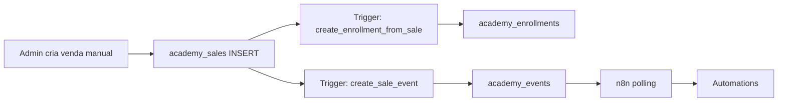
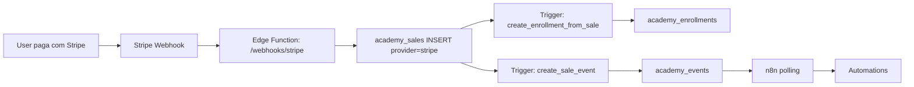

# Phase 9.1: Event-Based Automation System (n8n-ready)

**Status**: Planning  
**Data**: 2026-01-23  
**Dependencies**: Phases 8.0, 9.0-1, 9.0-2 completas

---

## 🎯 Objetivo

Criar sistema de automações baseado em `academy_events` que:
- Funciona hoje com vendas manuais
- Funcionará amanhã com Stripe (zero refactors)
- Simula 100% comportamento Stripe
- Foco em valor de negócio

---

## 1. Automações MVP (Recomendadas)

### 📧 Email Automations

#### A) Welcome Email (Sale Created)
**Trigger**: `sale.created` event  
**When**: Imediatamente após venda manual/Stripe  
**To**: `payload.user_email`  
**Content**:
- Boas-vindas ao curso
- Link direto para `/curso/:slug`
- Credenciais de acesso (se novo user)
- Detalhes da compra

**Business Value**: 
- ✅ Reduz support (user sabe como aceder)
- ✅ Profissionalismo (email automático)
- ✅ Primeiro contacto positivo

---

#### B) Course Completion Email
**Trigger**: `course.completed` event (futuro)  
**When**: Student atinge 100% progresso  
**To**: `payload.user_email`  
**Content**:
- Parabéns pela conclusão
- Certificado PDF (se implementado)
- Próximos cursos recomendados
- Pedir review/testemunho

**Business Value**:
- ✅ Engagement pós-curso
- ✅ Upsell (outros cursos)
- ✅ Social proof (reviews)

---

### 🔔 Notification Automations

#### C) Admin Alert (New Sale)
**Trigger**: `sale.created` event  
**When**: Qualquer venda (manual ou Stripe)  
**To**: Admin Slack/Email  
**Content**:
- Nome do curso vendido
- Email do aluno
- Valor da venda
- Provider (manual/stripe)

**Business Value**:
- ✅ Visibilidade em tempo real
- ✅ Deteção de problemas rápida
- ✅ Motivação (ver vendas a acontecer)

---

#### D) Payment Failed Alert
**Trigger**: `sale.failed` event (futuro Stripe)  
**When**: Stripe webhook `payment_intent.failed`  
**To**: Admin + User  
**Content**:
- Detalhes do erro
- Link para retry payment
- Support contact

**Business Value**:
- ✅ Reduz abandoned carts
- ✅ Recover revenue
- ✅ Better UX

---

### 🔗 Webhook Automations

#### E) External CRM Sync
**Trigger**: `sale.created` event  
**When**: Venda confirmada  
**To**: CRM externo (ex: HubSpot, Pipedrive)  
**Action**: Criar/atualizar contacto com tag "Customer"

**Business Value**:
- ✅ Dados sincronizados
- ✅ Marketing automation
- ✅ Customer journey tracking

---

#### F) Analytics/BI Integration
**Trigger**: Todos os eventos  
**When**: Qualquer evento em `academy_events`  
**To**: Google Analytics, Mixpanel, etc.  
**Action**: Track como custom event

**Business Value**:
- ✅ Funnels de conversão
- ✅ A/B testing
- ✅ Business intelligence

---

### 📊 Backoffice Automations

#### G) Daily Sales Report
**Trigger**: Cron (daily 9AM)  
**When**: Todos os dias  
**To**: Admin email  
**Content**:
- Total sales (manual + stripe)
- Revenue do dia
- Top courses
- New students

**Business Value**:
- ✅ KPIs diários
- ✅ Tomar decisões rápidas
- ✅ Spot trends

---

#### H) Abandoned Enrollments Cleanup
**Trigger**: Cron (weekly)  
**When**: Todas as semanas  
**Action**: Apagar enrollments com `payment_status='pending'` > 7 dias

**Business Value**:
- ✅ Database hygiene
- ✅ Accurate metrics
- ✅ Audit trail clean

---

## 2. Estrutura Webhook n8n

### Endpoint Recomendado

```
POST https://n8n.yourdomain.com/webhook/academy-events
```

### Request Body (Event Payload)

```json
{
  "event_id": "uuid",
  "event_name": "sale.created",
  "event_version": "1",
  "occurred_at": "2026-01-23T10:00:00Z",
  "sale_id": "uuid",
  "payload": {
    "sale_id": "uuid",
    "sale_created_at": "2026-01-23T10:00:00Z",
    "amount_cents": 14900,
    "currency": "EUR",
    "payment_status": "paid",
    "provider": "manual",
    "stripe_customer_id": null,
    "stripe_payment_intent_id": null,
    "stripe_checkout_session_id": null,
    "course_id": "uuid",
    "course_title": "Curso Exemplo",
    "user_id": "uuid",
    "user_email": "aluno@example.com",
    "metadata": {
      "admin_created": true
    }
  }
}
```

### Headers

```
Content-Type: application/json
X-Event-Signature: sha256_hmac (para validação)
X-Event-ID: uuid (para idempotência)
```

---

### Retry Logic

**Estratégia**: Exponential backoff

1. **Attempt 1**: Imediatamente
2. **Attempt 2**: +5 min
3. **Attempt 3**: +15 min
4. **Attempt 4**: +1 hora
5. **Attempt 5**: +6 horas
6. **Failed**: Marcar como `failed`, alertar admin

**Implementation**: n8n built-in retry ou custom em Supabase Edge Function

---

### Idempotência

**Problem**: Evitar processar mesmo evento 2x (ex: email duplicado)

**Solution**: 

1. **n8n**: Check `X-Event-ID` header antes de processar
2. **Database**: Adicionar coluna `processed_at` em `academy_events`

```sql
-- Ao processar evento
UPDATE academy_events 
SET processed_at = NOW() 
WHERE id = 'EVENT_ID' 
  AND processed_at IS NULL;

-- Se 0 rows affected → já foi processado, skip
```

---

### Status Tracking

Adicionar colunas a `academy_events`:

```sql
ALTER TABLE academy_events ADD COLUMN IF NOT EXISTS processed_at TIMESTAMPTZ;
ALTER TABLE academy_events ADD COLUMN IF NOT EXISTS processor VARCHAR(50); -- 'n8n', 'zapier', etc
ALTER TABLE academy_events ADD COLUMN IF NOT EXISTS attempts INT DEFAULT 0;
ALTER TABLE academy_events ADD COLUMN IF NOT EXISTS last_error TEXT;
```

**Query para n8n polling**:

```sql
SELECT * FROM academy_events 
WHERE processed_at IS NULL 
  AND attempts < 5
ORDER BY occurred_at ASC
LIMIT 100;
```

---

## 3. Validação de Payload

### ✅ Campos Presentes (Suficientes)

| Campo | Presente | Uso |
|-------|----------|-----|
| `event_id` | ✅ | Idempotência |
| `event_name` | ✅ | Routing |
| `event_version` | ✅ | Versionamento |
| `occurred_at` | ✅ | Ordenação |
| `sale_id` | ✅ | Referência |
| `user_email` | ✅ | Email automation |
| `user_id` | ✅ | CRM sync |
| `course_id` | ✅ | Analytics |
| `course_title` | ✅ | Email content |
| `amount_cents` | ✅ | Revenue tracking |
| `currency` | ✅ | Multi-currency |
| `payment_status` | ✅ | Flow control |
| `provider` | ✅ | Analytics (manual vs stripe) |
| `stripe_*` | ✅ | Futuro Stripe |
| `metadata` | ✅ | Extensibility |

**Conclusão**: ✅ **Payload é 100% suficiente** para todas as automações MVP

---

### ⚠️ Campos Recomendados (Futuro)

Para melhorar ainda mais:

1. **`user_name`** (primeiro + último nome)
   - Para personalização de emails ("Olá João")
   - Não crítico (pode usar apenas email)

2. **`course_slug`**
   - Para links diretos (`/curso/:slug`)
   - **Solução**: Já existe `course_id`, pode query se necessário

3. **`enrollment_id`**
   - Para tracking direto
   - **Solução**: Pode query `academy_enrollments` por `sale_id`

**Decisão**: Manter payload atual. Adicionar campos só se necessidade real.

---

## 4. Plano de Integração Stripe (Futuro)

### Current State (Hoje)



### Future State (Com Stripe)



### Mudanças Necessárias

**Zero refactors no sistema de events!**

Apenas adicionar:

1. **Edge Function** `/api/webhooks/stripe`
   ```typescript
   // Recebe Stripe webhook
   const session = event.data.object;
   
   // Cria sale (resto é automático)
   await supabase.from('academy_sales').insert({
     user_id: userId,
     course_id: courseId,
     amount_cents: session.amount_total,
     payment_status: 'paid',
     provider: 'stripe', // <-- Só isto muda!
     metadata: {
       checkout_session_id: session.id,
       payment_intent_id: session.payment_intent,
       customer_id: session.customer
     }
   });
   // Enrollment + Event criados via triggers (unchanged!)
   ```

2. **n8n workflows** continuam iguais
   - Payload já tem `provider` field
   - Podem filtrar por `provider='stripe'` se necessário
   - Email templates iguais (manual ou stripe)

**Conclusão**: ✅ Sistema está **Stripe-ready sem refactors**

---

## 5. Próximos Passos (Implementação)

### Step 1: Preparar Database
- [ ] Adicionar colunas tracking a `academy_events`
- [ ] Criar índices para queries n8n

### Step 2: Setup n8n
- [ ] Instalar n8n (cloud ou self-hosted)
- [ ] Criar workflow polling `academy_events`
- [ ] Testar com evento manual

### Step 3: Implementar Automação A (Welcome Email)
- [ ] Template email em n8n
- [ ] Configurar SMTP
- [ ] Testar com venda manual
- [ ] Marcar evento como processado

### Step 4: Implementar Automação C (Admin Alert)
- [ ] Integrar Slack/Email
- [ ] Testar notificação
- [ ] Validar idempotência

### Step 5: Implementar Restantes
- [ ] Course completion
- [ ] Payment failed
- [ ] CRM sync
- [ ] Analytics
- [ ] Daily reports

### Step 6: Monitorização
- [ ] Dashboard n8n (execuções)
- [ ] Alertas para failed events
- [ ] Metrics (emails enviados, etc)

---

## 6. Success Criteria

**Phase 9.1 completa se**:

1. ✅ n8n instalado e funcional
2. ✅ Welcome email enviado automaticamente em vendas manuais
3. ✅ Admin recebe notificação de novas vendas
4. ✅ Eventos marcados como `processed_at` (idempotência)
5. ✅ Zero emails duplicados
6. ✅ Documentação atualizada (setup guide)
7. ✅ Sistema pronto para Stripe (só adicionar webhook handler)

---

## 7. Estimativa

**Total**: 2-3 dias

- Setup n8n: 2 horas
- Welcome email: 3 horas
- Admin alerts: 2 horas
- Idempotency + tracking: 2 horas
- Testes + validação: 3 horas
- Documentação: 2 horas

---

## 8. Riscos e Mitigação

| Risco | Impacto | Mitigação |
|-------|---------|-----------|
| n8n down | Alto | Usar queue (Supabase Realtime) |
| Email spam | Médio | Idempotência + rate limiting |
| Payload insuficiente | Baixo | Já validado, é suficiente |
| Stripe incompatível | Baixo | Payload já tem campos Stripe |
